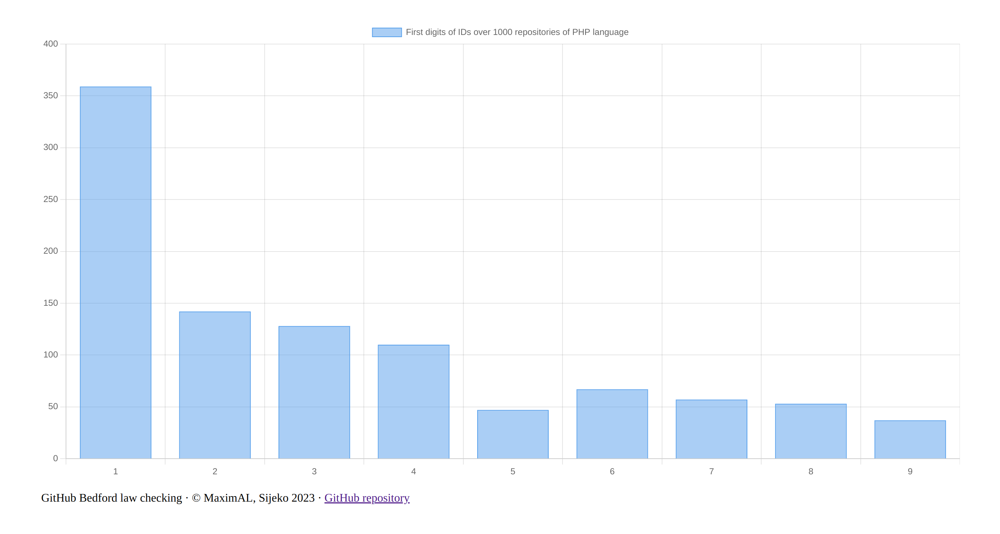
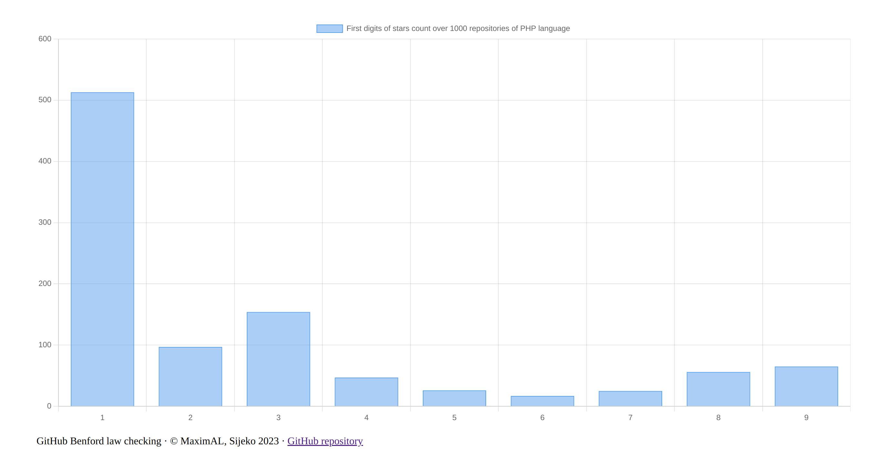
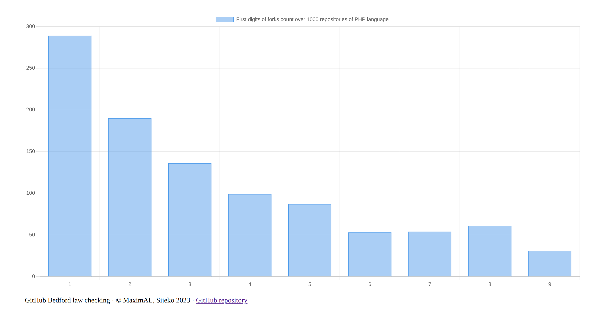
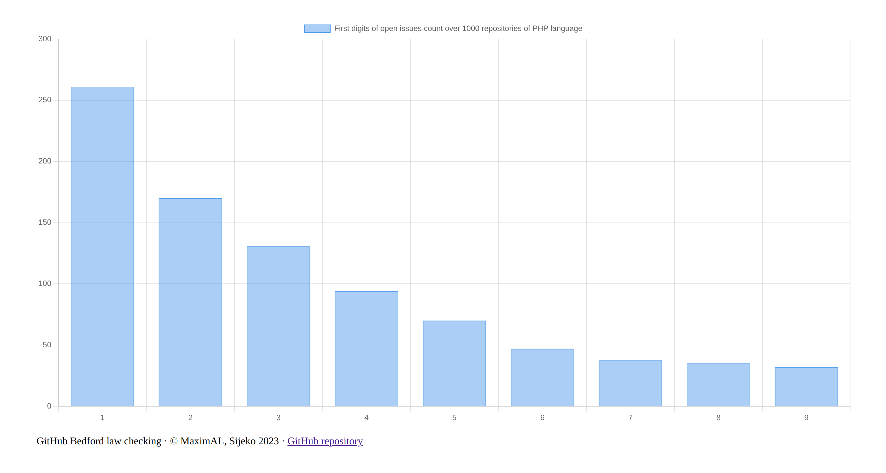

# GitHub Bedford law checking tool

This PHP script draws graphs checking [Bedford’s law](https://en.wikipedia.org/wiki/Benford's_law) over top 10..1000 GitHub repositories of given programming language.

Used repositories statistics numbers (from which first digits are extracted) are:
* repository IDs,
* stars count,
* forks count,
* open issues count.

Zero numbers (for instance, open issues count) are not processed.

The only dependencies to run the script are PHP 8.0+ CLI itself and PHP cURL extension.


## Usage

To run GitHub API you should get your GitHub access token:
https://github.com/settings/tokens

Clone this repository.

Install PHP 8.0+ CLI and PHP cURL extension. For example, on Debian/Ubuntu:
```shell
sudo apt install php-cli php-curl
```

Run the script
```sh
php run.php  <GitHub access token>  <repo language>  [repo count; 10...1000; default: 1000]
```

Explore files `ids.html`, `stars.html`, `forks.html`, `issues.html` in the current directory.


## Demo graphs for top 1000 PHP repositories:

```sh
php run.php  <GitHub access token>  PHP  1000
```










## Author
* https://github.com/maximal/github-bedford
* https://maximals.ru/
* https://sijeko.ru/
